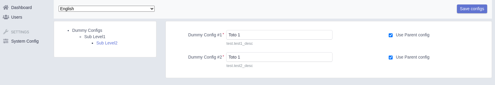

# Comfy Easy Admin Bundle

[](https://scrutinizer-ci.com/g/oliverde8/comfyEasyAdminBundle/?branch=master)
[](https://scrutinizer-ci.com/g/oliverde8/comfyEasyAdminBundle/build-status/master)
[](https://scrutinizer-ci.com/g/oliverde8/comfyEasyAdminBundle/?branch=master)
[](//packagist.org/packages/oliverde8/comfy-easy-admin-bundle) 
[](//packagist.org/packages/oliverde8/comfy-easy-admin-bundle) 
[](//packagist.org/packages/oliverde8/comfy-easy-admin-bundle) 
[](//packagist.org/packages/oliverde8/comfy-easy-admin-bundle)

This bundle adds the edition interface to easy admin so that admins can configure their site using comfy bundle. 

Check Comfy bundles documentation [here](https://github.com/oliverde8/comfyBundle)


## Install

```shell
composer require oliverde/comfy-easy-admin-bundle
```

To add a link to the menu edit your `DashnoardController` to inject the MenuConfigurator service: 

```php
protected MenuConfigurator $menuConfigurator;

/**
 * DashboardController constructor.
 * @param ConfigInterface $testConfig
 */
public function __construct(MenuConfigurator $menuConfigurator)
{
    $this->menuConfigurator = $menuConfigurator;
}
```

and now add the Menu link

```php
    public function configureMenuItems(): iterable
    {
        /** Other menu elements .... */
        yield $this->menuConfigurator->getMenuItem();
    }
```

Finally add the add router. 

```yaml
comfy_bundle:
    resource: '@oliverde8ComfyEasyAdminBundle/Controller'
    type: annotation
    prefix: /admin
```

You are ready to go, to create configuration elements check comfy bundles [documentation](https://github.com/oliverde8/comfyBundle)

## Permissions

By default any one with access to the EasyAdmin interface can edit any configuration. 

To limit this rewrite the `ConfigEditVoter` service with your own.

## TODO

- [ ] Allow separate view & edit permission.
